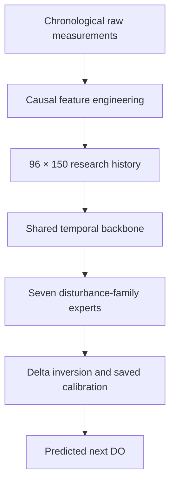

# OXYRA: Physics-Guided Dissolved-Oxygen Forecasting

### Oxygen Yielding Recurrent Architecture

[](https://www.python.org/)
[](https://pytorch.org/)
[](#what-oxyra-does)
[](OXYRA.pkl)
[](LICENSE)
[](DATA-LICENSE.md)
[](NOTICE)

OXYRA is a deep temporal forecasting system for predicting the next dissolved-oxygen (DO) value from recent sensor and actuator history. The repository contains a portable high-precision DO checkpoint, a public training and evaluation workbench, seven disturbance-family datasets, saved research metrics, and eight analysis figures.

The repository uses an explicit asset-level license split: the software and project-owned model/checkpoint are released under Apache License 2.0, while project-owned datasets, metrics, figures, and original documentation are released under CC BY 4.0. See [Licensing](#licensing), [`DATA-LICENSE.md`](DATA-LICENSE.md), and [`NOTICE`](NOTICE) for the exact scope and attribution requirements.

The project is designed to be useful to both researchers and beginners. You can:

- run the supplied DO checkpoint on compatible data;
- inspect the checkpoint metadata;
- train a public research-aligned LSTM on the included datasets;
- train the same public workflow on another numeric time-series dataset or domain;
- evaluate exported models with chronological, leakage-aware windows; and
- generate predictions, metrics, CSV reports, and diagnostic plots.

> [!IMPORTANT]
> This repository supports two related but different workflows. `OXYRA.pkl` is the fixed, high-precision research checkpoint and is available for inference. `OXYRA.py train` builds a public research-aligned or compact LSTM, but it does **not** reproduce the complete private 150-feature, seven-expert training pipeline that created `OXYRA.pkl`. This distinction is explained in [Two supported workflows](#two-supported-workflows) and [Reproducibility](#reproducibility).

---

## Table of contents

- [Overview](#overview)
- [Repository at a glance](#repository-at-a-glance)
- [What OXYRA does](#what-oxyra-does)
- [Two supported workflows](#two-supported-workflows)
- [Key results](#key-results)
- [Visual analysis](#visual-analysis)
- [Repository contents](#repository-contents)
- [Datasets](#datasets)
- [Model architecture](#model-architecture)
- [Installation](#installation)
- [Quick start](#quick-start)
- [Use the pretrained checkpoint](#use-the-pretrained-checkpoint)
- [Retrain the public model](#retrain-the-public-model)
- [Evaluate a trained public model](#evaluate-a-trained-public-model)
- [Use your own data or another domain](#use-your-own-data-or-another-domain)
- [Command reference](#command-reference)
- [Generated outputs](#generated-outputs)
- [Reproducibility](#reproducibility)
- [Limitations and responsible use](#limitations-and-responsible-use)
- [Troubleshooting](#troubleshooting)
- [Licensing](#licensing)
- [Citation](#citation)
- [Contributing](#contributing)
- [Developer](#developer)

---

## Overview

Dissolved oxygen is a central water-quality variable in aquaculture and other aquatic systems. DO changes over time in response to biological demand, aeration, temperature, mixing, sensor behavior, actuator operation, and measurement disturbance. A useful forecasting model must therefore learn both the slow operating trend and the short, local changes that occur between consecutive measurements.

OXYRA addresses this as a **one-step, paired-clean forecasting problem**. The research checkpoint receives the previous 96 time steps, identifies the declared disturbance family, estimates the next DO change, applies its stored causal calibration, and returns the predicted next DO value.

For the included five-second sample data, the prediction relationship is:

```text
96 historical rows = 96 × 5 seconds = 480 seconds = 8 minutes of context

rows [t-96, ..., t-1]  --->  predicted clean DO at row [t]
```

The lookback is measured in rows, not in fixed wall-clock time. If your sampling interval is different, 96 rows will cover a different duration.

### What physics-guided means here

OXYRA is data-driven, but it uses physically meaningful sensor and actuator variables together with derived interaction features. Examples stored in the checkpoint preprocessing include:

- electrical power proxy: `voltage × current`;
- drive proxy: `dac × rpm`;
- sensor-load ratio: `current / |dac|`;
- short- and medium-window means, standard deviations, medians, slopes, and residuals;
- temporal differences, activity indicators, step indicators, and periodic time encodings; and
- causal histories that never use a future observation as an input.

In this repository, “physics-guided” therefore means **physics-aware variables, proxies, causal structure, and bounded research calibration**. It does not mean that OXYRA solves a first-principles oxygen mass-balance equation or enforces a conservation law in every prediction.

---

## Repository at a glance

| Item | Verified repository value |
|---|---:|
| Main task | One-step dissolved-oxygen forecasting toward a paired clean target |
| Raw research variables | `dac`, `voltage`, `current`, `rpm`, `temperature`, `do` |
| Research history length | 96 time steps |
| Research feature width | 150 features: 137 continuous + 13 categorical/context features |
| Disturbance families | clean, drift, impulse, PLI, quantization, ripple, WGN |
| Included demonstration data | 7 CSV files, 300 rows each, 2,100 rows total |
| Saved held-out evaluation | 5,274 prediction windows |
| Supplied checkpoint | `OXYRA.pkl`, 1,369,122 bytes (about 1.31 MiB) |
| Framework | PyTorch / TorchScript checkpoint inside a metadata bundle |
| Public training profiles | `research-aligned` and `compact` |
| Code and project-owned model license | Apache License 2.0 |
| Project-owned data, metrics, figures, and documentation license | CC BY 4.0 |
| License and attribution files | `LICENSE`, `DATA-LICENSE.md`, and `NOTICE` |

The technical and licensing audit behind this README was completed against repository state `0b43fb9bb2d2681d8adefa4370a66518e39902c7` on the `main` branch on 7 August 2026.

---

## What OXYRA does

At a high level, OXYRA turns recent time-ordered measurements into a next-step DO estimate:



The supplied research inference path performs the following operations:

1. Reads one CSV, a directory of CSVs, or a CSV glob.
2. Checks the required columns and rejects missing or non-numeric values.
3. Sorts each physical series by family, optional series identifier, and timestamp.
4. Builds the fixed causal features expected by the checkpoint.
5. Standardizes continuous features using scalers saved inside `OXYRA.pkl`.
6. Constructs 96-row histories without crossing series boundaries.
7. Runs the embedded TorchScript model.
8. Converts the predicted scaled DO delta back to mg/L using the stored family transform.
9. Applies the saved family, context, activity, and temporal calibration stages.
10. Adds the calibrated delta to the current DO observation and applies the stored output bounds.
11. Saves predictions and, when a known target is provided, accuracy metrics and six diagnostic plots.

OXYRA forecasts DO. It does not directly operate a pump, aerator, relay, or motor in this repository.

---

## Two supported workflows

| Workflow | Command | Purpose | Important boundary |
|---|---|---|---|
| Supplied research checkpoint | `research-predict` | Run `OXYRA.pkl` on data matching its DO schema | Fixed 96-step, 150-feature DO model; not suitable for arbitrary domains without new training and validation |
| Public model training | `train` | Train a new research-aligned or compact LSTM | Reuses the public backbone and sound time-series procedure, but not the complete original seven-expert research recipe |
| Public model evaluation | `evaluate` | Evaluate or predict with a model created by `train` | Cannot be used to evaluate the supplied research checkpoint; use `research-predict` for that file |
| Metadata inspection | `inspect` | Print stored model metadata | Loads a pickle; use only trusted model files |

This separation prevents accidental claims that a model trained through the public command is identical to the supplied OXYRA research checkpoint.

---

## Key results

The following values are stored in `OXYRA.pkl` and summarized in [`research_overall_metrics.csv`](Metrices%20%26%20%20Analysis/research_overall_metrics.csv). They refer to the original **chronological, paired-clean held-out test split**, not to the seven 300-row demonstration CSVs alone.

### Overall held-out performance

| Model | Evaluated rows | MAE (mg/L) | RMSE (mg/L) | R² |
|---|---:|---:|---:|---:|
| OXYRA research LSTM | 5,274 | 0.049262 | 0.073760 | 0.999347 |
| Persistence baseline | 5,274 | 0.163175 | 0.288919 | 0.989988 |

A persistence forecast simply assumes that the next DO value will be equal to the current observed DO. Relative to that baseline, the stored research evaluation reports:

- **69.81% lower MAE**;
- **74.47% lower RMSE**;
- median absolute error of **0.030855 mg/L**;
- mean prediction bias (`prediction - target`) of **+0.009396 mg/L**;
- Pearson correlation of **0.999679**;
- active directional accuracy of **98.11%**; and
- maximum absolute error of **0.553331 mg/L** on the saved test split.

### Performance by disturbance family

The exact values are available in [`research_family_metrics.csv`](Metrices%20%26%20%20Analysis/research_family_metrics.csv).

| Family | Held-out rows | MAE (mg/L) | RMSE (mg/L) |
|---|---:|---:|---:|
| Clean | 752 | 0.024430 | 0.031710 |
| Drift | 754 | 0.105131 | 0.123071 |
| Impulse | 750 | 0.039430 | 0.058143 |
| PLI | 754 | 0.026147 | 0.033764 |
| Quantization | 754 | 0.028075 | 0.037519 |
| Ripple | 751 | 0.028313 | 0.036815 |
| WGN | 759 | 0.092820 | 0.120617 |

Drift and white Gaussian noise are the most difficult families in this saved evaluation. Clean, PLI, quantization, and ripple have the lowest absolute errors.

### How to interpret the metrics

- **MAE** is the average absolute difference between prediction and target. Lower is better and the value remains in mg/L.
- **RMSE** penalizes large misses more heavily than MAE. Lower is better.
- **R²** measures how much target variation is explained on this particular split. Values closer to 1 are better, but a high R² on controlled synthetic data does not prove field generalization.
- **Bias** is the mean signed residual. Positive bias means the model predicts slightly above the target on average.
- **Directional accuracy** measures whether the model predicts the direction of the next change correctly. “Active” directional accuracy focuses on non-trivial changes.

The bundle also stores an extremely large MAPE because the research corpus contains values at or near zero. Percentage errors become unstable when the denominator is nearly zero, so MAE, RMSE, residual diagnostics, and persistence skill are the more meaningful headline measures here.

---

## Visual analysis

Every PNG currently present in `Analysis Plots/` is embedded below with its research meaning. The paths are repository-relative so the images continue to render on forks and clones as long as the current filenames and folders are preserved.

### Global predicted-versus-true agreement

The points cluster tightly around the black 1:1 line across all seven disturbance families. This shows strong agreement over the broad controlled DO range, while the wider spread near the lowest DO values and in the drift/WGN families identifies the harder regions.


### Local temporal tracking

This saved example shows one `set6_drift_v2` test sequence. The upper panel compares true DO, OXYRA prediction, and persistence. The lower panel compares the true and predicted one-step DO changes. The OXYRA trace follows the local trend more closely than the visibly noisier persistence trace in this example.


### Skill against persistence

The upper panels compare family-level MAE and RMSE. The lower panels show error reduction relative to persistence. OXYRA improves both metrics in every displayed family, although the size of the improvement differs by disturbance type.


### Family-level error summary

This figure compares MAE, RMSE, active directional accuracy, and the MAE ratio to persistence. A ratio below the horizontal reference of 1 means that OXYRA has lower MAE than persistence.


### Error by disturbance family and DO range

The heatmaps divide the original held-out target range into nine global DO quantile bins. The upper panel shows mean absolute error; the lower panel shows the 95th-percentile absolute error. Drift and WGN remain the most difficult families across much of the range, while the other families generally remain lower.


### Residual diagnostics

The residual diagnostic figure combines the residual distribution, absolute-error empirical CDF, within-series residual autocorrelation, and residual density over the target range. The saved evaluation reports a small positive bias. The figure also shows that errors are not perfectly independent across time, so R² alone should not be used as the only quality measure.


### Structure of the synthetic disturbances

This analysis quantifies each synthetic disturbance relative to its paired clean signal. It compares DO noise RMSE, lag-1 residual autocorrelation, dominant residual period, and spectral peak strength. Drift, periodic line interference, ripple, quantization, impulse, and WGN intentionally have different temporal signatures.


### Training convergence and validation control

The saved research run lasted 55 epochs and selected epoch 45 as its best validation checkpoint. The panels show the total objective, direct DO-head MAE, validation model-selection score, parameter-update norm, and learning-rate reductions. The separation between falling training loss and flatter validation loss is why validation-based checkpoint selection and early stopping are necessary.


---

## Repository contents

```text
.
├── OXYRA.py
├── OXYRA.pkl
├── README.md
├── LICENSE
├── DATA-LICENSE.md
├── NOTICE
├── Datasets/
│   ├── DO Clean.csv
│   ├── DO Drift.csv
│   ├── DO Impulse.csv
│   ├── DO PLI.csv
│   ├── DO Quantization.csv
│   ├── DO Ripple.csv
│   └── DO WGN.csv
├── Analysis Plots/
│   ├── error_landscape_family_do_range.png
│   ├── family_error_summary.png
│   ├── heldout_residual_diagnostics.png
│   ├── model_vs_persistence_benchmark.png
│   ├── predicted_vs_true_overlay.png
│   ├── predicted_vs_true_scatter.png
│   ├── synthetic_noise_residuals.png
│   └── training_convergence_analysis.png
└── Metrices &  Analysis/
    ├── research_family_metrics.csv
    └── research_overall_metrics.csv
```

| Path | Purpose |
|---|---|
| [`OXYRA.py`](OXYRA.py) | Single command-line program for training, evaluating, research inference, model inspection, metrics, and plots |
| [`OXYRA.pkl`](OXYRA.pkl) | Portable research inference bundle containing metadata, scalers, calibration, and TorchScript model bytes |
| [`Datasets/`](Datasets) | Seven synchronized 300-row DO disturbance-family examples |
| [`Analysis Plots/`](Analysis%20Plots) | Eight saved research figures embedded above |
| [`research_family_metrics.csv`](Metrices%20%26%20%20Analysis/research_family_metrics.csv) | Per-family held-out MAE and RMSE |
| [`research_overall_metrics.csv`](Metrices%20%26%20%20Analysis/research_overall_metrics.csv) | Overall OXYRA and persistence metrics |
| [`LICENSE`](LICENSE) | Apache License 2.0 terms for the software and project-owned model/checkpoint artifact |
| [`DATA-LICENSE.md`](DATA-LICENSE.md) | CC BY 4.0 scope, exclusions, and attribution instructions for project-owned data, metrics, figures, and original documentation |
| [`NOTICE`](NOTICE) | Project attribution and the relationship between the Apache 2.0 and CC BY 4.0 license scopes |

> [!NOTE]
> The directory name `Metrices &  Analysis` contains the spelling and two spaces currently present in the repository. The encoded links in this README deliberately match that exact path.

---

## Datasets

### Included disturbance families

All seven CSV files contain 300 rows, cover timestamps from 0 to 1,495 seconds, use an exact five-second interval, contain no missing values, and contain no duplicate rows. They share the same paired `clean_do` reference sequence.

| Dataset | Family label | Rows | Signals changed relative to the clean file | Intended challenge |
|---|---|---:|---|---|
| [`DO Clean.csv`](Datasets/DO%20Clean.csv) | `clean` | 300 | None | Undisturbed reference behavior |
| [`DO Drift.csv`](Datasets/DO%20Drift.csv) | `drift` | 300 | temperature, DO | Gradually accumulating sensor offset |
| [`DO Impulse.csv`](Datasets/DO%20Impulse.csv) | `impulse` | 300 | current, DO | Rare sharp spikes or drops |
| [`DO PLI.csv`](Datasets/DO%20PLI.csv) | `pli` | 300 | current, DO | Periodic line interference |
| [`DO Quantization.csv`](Datasets/DO%20Quantization.csv) | `quantization` | 300 | current, temperature, DO | Finite measurement resolution and step-like values |
| [`DO Ripple.csv`](Datasets/DO%20Ripple.csv) | `ripple` | 300 | DAC, voltage, current, DO | Periodic actuator/electrical ripple |
| [`DO WGN.csv`](Datasets/DO%20WGN.csv) | `wgn` | 300 | all six raw variables | Broadband white Gaussian measurement noise |

### CSV schema

| Column | Required for research inference? | Meaning |
|---|---|---|
| `timestamp` | Yes | Numeric time value; the included data uses seconds |
| `dac` | Yes | DAC/control-input value |
| `voltage` | Yes | Electrical voltage measurement |
| `current` | Yes | Electrical current measurement |
| `rpm` | Yes | Rotational-speed measurement |
| `temperature` | Yes | Temperature measurement |
| `do` | Yes | Current observed/noisy dissolved oxygen |
| `clean_do` | Optional for inference; used as target in examples | Paired clean/reference DO in mg/L |
| `family` | Recommended | One of `clean`, `drift`, `impulse`, `pli`, `quantization`, `ripple`, or `wgn` |
| `sample_index` | No | Row index supplied for readability and pairing |

The code does not accept missing or non-numeric values in selected numeric columns. Clean, impute, or remove invalid values before running the workbench, and document the chosen procedure.

### Demonstration data versus the original research split

The seven CSV files provide **2,100 readable demonstration rows**. The saved headline results use **5,274 held-out prediction windows** from the larger original controlled Set 6/Set 7 research corpus recorded in the checkpoint metadata. Therefore:

- the demonstration CSVs are suitable for learning the workflow, testing the interface, and training a new public model;
- the demonstration CSVs are not the complete original train/validation/test corpus;
- rerunning inference on the seven demonstration files is a new evaluation and should be reported separately; and
- the stored R² of 0.999347 must not be described as a result calculated only from the included 2,100 rows.

---

## Model architecture

### Supplied OXYRA research checkpoint

The fixed checkpoint expects three inputs:

| Input | Shape | Meaning |
|---|---|---|
| `history` | `[batch, 96, 150]` | Standardized causal temporal features |
| `family_gate` | `[batch, 7]` | One-hot disturbance-family identifier |
| `current_do_scaled` | `[batch, 1]` | Current DO in checkpoint-scaled form |

It returns three internal outputs:

1. scaled direct DO output;
2. scaled next-step DO delta; and
3. a dynamic sequence output.

The public `research-predict` command reconstructs the final next-step forecast from the delta output, the current DO, and the stored calibration.

The checkpoint architecture contains:

- local, medium-period, and long-period causal convolution filters;
- a bidirectional context LSTM followed by forward dynamics and trend LSTMs;
- residual temporal convolution refiners with multiple dilations;
- trend and transient attention summaries;
- recent-window and raw-tail detail branches;
- a shared dense temporal representation;
- seven family-specific experts for clean, drift, impulse, PLI, quantization, ripple, and WGN; and
- direct-DO, delta, and dynamic-sequence heads.

The stored balanced backbone sizes are:

| Component | Stored width/value |
|---|---:|
| Multiscale convolution width | 32 main channels, with additional 16-channel branches |
| Bidirectional context LSTM | 48 hidden units per direction |
| Dynamics LSTM | 48 hidden units |
| Trend LSTM | 32 hidden units |
| Dense layers | 80 then 48 units |
| Training-time Gaussian input noise | 0.012 |
| Dense dropout | 0.14 then 0.10 |

### Public research-aligned training profile

The public `research-aligned` profile keeps the safe high-level backbone:

- causal convolution branches with widths 32, 16, and 16;
- kernels 3, 5, and 7 with dilations 1, 2, and 4;
- recurrent hidden sizes 48, 48, and 32;
- residual temporal convolution dilations 1, 2, and 4;
- trend and transient attention; and
- an 80/48-unit regression head.

It intentionally excludes the complete original 150-feature recipe, seven research experts, auxiliary delta heads, full calibration and selection orchestration, synthetic generator, and full research corpus. Use it to train a strong, transparent public baseline or to adapt the workflow to another domain; do not label its output as an exact reproduction of `OXYRA.pkl`.

### Compact training profile

The `compact` profile is intended for faster experiments and smaller CPUs. Its defaults are a two-layer LSTM with 64 hidden units, layer normalization, SiLU-activated dense layers, and dropout. You can change its hidden width, layer count, dropout, and directionality from the command line.

---

## Installation

### Requirements

- Python 3.10 or newer;
- NumPy;
- pandas;
- Matplotlib; and
- PyTorch.

A GPU is optional. CPU inference and training are supported, although research-aligned training will be faster on a compatible CUDA GPU.

### Clone the repository

```bash
git clone https://github.com/Agnibha-31/OXYRA-Powered-Physics-Guided-DO-Forecasting-Temporal-Intelligence.git
cd OXYRA-Powered-Physics-Guided-DO-Forecasting-Temporal-Intelligence
```

### Create a virtual environment

macOS or Linux:

```bash
python3 -m venv .venv
source .venv/bin/activate
```

Windows PowerShell:

```powershell
py -m venv .venv
.\.venv\Scripts\Activate.ps1
```

### Install the dependencies

```bash
python -m pip install --upgrade pip
python -m pip install numpy pandas matplotlib torch
```

For a platform-specific CUDA build, use the official [PyTorch installation selector](https://pytorch.org/get-started/locally/) instead of guessing a CUDA package command.

### Confirm that the command-line interface loads

```bash
python OXYRA.py --help
```

The executable filename in this repository is `OXYRA.py`. An internal source-code docstring still shows the older example name `lstm_workbench.py`; use `OXYRA.py` in all commands.

---

## Quick start

### 1. Inspect the supplied checkpoint

```bash
python OXYRA.py inspect --model OXYRA.pkl
```

The command prints the artifact type, model name, input shape, stored test metrics, provenance, and limitations.

### 2. Run the checkpoint on one included dataset

```bash
python OXYRA.py research-predict \
  --model OXYRA.pkl \
  --csv "Datasets/DO Clean.csv" \
  --target clean_do \
  --family-column family \
  --set-id set6 \
  --variant v1 \
  --output outputs/research_clean
```

### 3. Inspect the results

The command produces:

```text
outputs/research_clean/
├── research_predictions.csv
├── metrics.json
├── metrics.csv
└── plots/
    ├── 01_training_or_error_curve.png
    ├── 02_actual_vs_predicted.png
    ├── 03_predicted_vs_actual_scatter.png
    ├── 04_residuals_vs_predicted.png
    ├── 05_residual_histogram.png
    └── 06_error_by_target_quantile.png
```

With 300 input rows and a 96-row lookback, this example generates 204 next-step predictions.

> [!NOTE]
> The default `research-predict` model path inside the current script points to an `artifacts/` location that is not present in this repository. Always pass `--model OXYRA.pkl` as shown above.

---

## Use the pretrained checkpoint

### Run all seven included families together

```bash
python OXYRA.py research-predict \
  --model OXYRA.pkl \
  --csv Datasets \
  --target clean_do \
  --family-column family \
  --set-id set6 \
  --variant v1 \
  --batch-size 256 \
  --device cpu \
  --output outputs/research_all_families
```

Because the directory contains one 300-row file for each of the seven families, this command creates 1,428 predictions in total.

### Predict when the future target is unknown

Use the same command but omit `--target`. Your CSV must still contain the required raw columns and should contain a valid `family` column.

```bash
python OXYRA.py research-predict \
  --model OXYRA.pkl \
  --csv path/to/new_do_series.csv \
  --family-column family \
  --output outputs/new_do_predictions
```

When no target is supplied, the command saves predictions but cannot calculate accuracy metrics or target-based plots.

### Multiple physical series

If a file contains more than one independent sensor run, tank, pond, site, or experiment, add a column such as `series_id` and pass:

```bash
--series-column series_id
```

This prevents a 96-row history from joining the end of one physical series to the beginning of another.

### Research prediction output columns

| Column | Meaning |
|---|---|
| `source_row` | Original zero-based source-row position |
| `family` | Disturbance family used by the gate |
| `series_id` | Physical-series identifier used for grouping |
| `current_do` | Last observed DO before the predicted row |
| `predicted_next_do` | OXYRA next-step DO prediction |
| `actual_next_do` | Known target, included only when `--target` is supplied |
| `error_pred_minus_actual` | Signed residual |
| `absolute_error` | Absolute residual |

---

## Retrain the public model

### Train on all seven included datasets

```bash
python OXYRA.py train \
  --csv Datasets \
  --features dac voltage current rpm temperature do \
  --target clean_do \
  --time timestamp \
  --group family \
  --profile research-aligned \
  --lookback 96 \
  --horizon 1 \
  --epochs 70 \
  --batch-size 256 \
  --learning-rate 0.0008 \
  --seed 42 \
  --device auto \
  --output outputs/public_retraining
```

This command trains a new public research-aligned model. It does not overwrite `OXYRA.pkl`.

### Train the smaller compact profile

```bash
python OXYRA.py train \
  --csv Datasets \
  --features dac voltage current rpm temperature do \
  --target clean_do \
  --time timestamp \
  --group family \
  --profile compact \
  --hidden-size 64 \
  --num-layers 2 \
  --dropout 0.15 \
  --lookback 96 \
  --epochs 70 \
  --output outputs/compact_retraining
```

### What the trainer does

1. Loads one CSV, a folder of CSVs, or a CSV glob.
2. Sorts rows stably by group and time.
3. Splits every group chronologically into training, validation, and test targets.
4. Fits input and target standardizers on training rows only.
5. Builds causal lookback windows without crossing group boundaries.
6. Trains with AdamW, Huber loss, gradient clipping, validation-based learning-rate reduction, and early stopping.
7. Restores the best validation checkpoint.
8. Evaluates once on the chronological test targets.
9. Saves the new model bundle, predictions, metrics, and six diagnostic figures.

The trainer allows validation and test targets to use earlier observations as causal context, as a deployed forecaster would. A future observation is never placed inside an input history.

---

## Evaluate a trained public model

Use `evaluate` only with a bundle created by `OXYRA.py train`:

```bash
python OXYRA.py evaluate \
  --model outputs/public_retraining/trained_lstm_model.pkl \
  --csv path/to/independent_evaluation_data.csv \
  --target clean_do \
  --time timestamp \
  --group family \
  --batch-size 256 \
  --device auto \
  --output outputs/independent_evaluation
```

For prediction without a known target:

```bash
python OXYRA.py evaluate \
  --model outputs/public_retraining/trained_lstm_model.pkl \
  --csv path/to/unlabelled_data.csv \
  --prediction-only \
  --time timestamp \
  --group series_id \
  --output outputs/unlabelled_predictions
```

Evaluating a newly trained model on the same rows used for training is not an independent generalization test. Prefer a later time period, a held-out sensor/site, or another untouched series.

---

## Use your own data or another domain

The public trainer is domain-generic when the following conditions are met:

- every selected feature is numeric;
- the target is numeric;
- each row is one time step;
- rows can be sorted by a time/order column;
- separate physical sequences have a group identifier; and
- each group is long enough to create lookback windows and non-empty chronological splits.

Example schema:

```csv
timestamp,series_id,feature_1,feature_2,feature_3,target
0,A,1.20,8.40,0.18,2.10
1,A,1.24,8.35,0.19,2.14
2,A,1.27,8.31,0.21,2.18
```

Example training command:

```bash
python OXYRA.py train \
  --csv path/to/your_dataset.csv \
  --features feature_1 feature_2 feature_3 \
  --target target \
  --time timestamp \
  --group series_id \
  --profile research-aligned \
  --lookback 48 \
  --horizon 1 \
  --epochs 70 \
  --output outputs/my_domain_model
```

### Choose the lookback carefully

Use this relationship:

```text
history duration = lookback rows × sampling interval per row
```

Examples:

| Sampling interval | Lookback | Covered history |
|---:|---:|---:|
| 5 seconds | 96 | 8 minutes |
| 1 minute | 60 | 1 hour |
| 15 minutes | 96 | 24 hours |

A larger lookback is not automatically better. It increases memory and computation and may introduce irrelevant history. Select it with validation data from the intended deployment domain.

### Avoid common leakage mistakes

- Do not randomly shuffle time rows before splitting.
- Do not fit scalers on the full dataset before defining the test period.
- Do not let a window cross from one physical series into another.
- Do not tune the model repeatedly against the final test data.
- Do not report results from a training or validation set as unseen performance.
- Keep the feature and target definitions identical between training and deployment.

---

## Command reference

### `train`

| Argument | Default | Description |
|---|---|---|
| `--csv` | Required | CSV file, directory, or glob |
| `--features` | Required | Space-separated numeric input columns |
| `--target` | Required | Numeric target column |
| `--time` | None | Optional chronological ordering column |
| `--group` | None | Optional independent-series column |
| `--profile` | `research-aligned` | `research-aligned` or `compact` |
| `--lookback` | 96 | Historical rows per input sample |
| `--horizon` | 1 | Forecast steps ahead |
| `--train-fraction` | 0.70 | Fraction of each group used for training targets |
| `--validation-fraction` | 0.15 | Fraction used for validation targets; the remainder is test |
| `--epochs` | 70 | Maximum training epochs |
| `--batch-size` | 256 | Batch size |
| `--learning-rate` | 0.0008 | Initial AdamW learning rate |
| `--weight-decay` | 0.00001 | AdamW weight decay |
| `--huber-delta` | 0.75 | Huber threshold in scaled-target space |
| `--patience` | 10 | Early-stopping patience |
| `--reduce-lr-patience` | 4 | Validation plateaus before lowering the learning rate |
| `--seed` | 42 | Random seed |
| `--device` | `auto` | `auto`, `cpu`, or `cuda` |
| `--output` | `outputs/training_run` | Output directory |

Compact-only options are `--hidden-size`, `--num-layers`, `--dropout`, and `--bidirectional`.

### `evaluate`

| Argument | Description |
|---|---|
| `--model` | Public trainer-exported `.pkl` bundle |
| `--csv` | Evaluation CSV file, directory, or glob |
| `--target` | Optional target override |
| `--prediction-only` | Save predictions without requiring a target |
| `--time` | Optional ordering-column override |
| `--group` | Optional series/group-column override |
| `--batch-size` | Inference batch size |
| `--device` | `auto`, `cpu`, or `cuda` |
| `--output` | Output directory |

### `research-predict`

| Argument | Default | Description |
|---|---|---|
| `--model` | Pass `OXYRA.pkl` explicitly | Supplied high-precision research bundle |
| `--csv` | Required | Compatible DO CSV file, directory, or glob |
| `--target` | None | Optional known next-step target, such as `clean_do` |
| `--family-column` | `family` | Column containing a supported family label |
| `--family` | `clean` | Fixed family used only when no family column is selected |
| `--series-column` | None | Optional independent physical-series identifier |
| `--set-id` | `set6` | Research context flag: `set6` or `set7` |
| `--variant` | `v1` | Research context flag: `v1`, `v2`, `v3`, or `v4` |
| `--batch-size` | 256 | Inference batch size |
| `--device` | `cpu` | `cpu` or `cuda` |
| `--output` | `outputs/research_inference` | Output directory |

The `set-id` and `variant` values are part of the fixed checkpoint context. They should describe the data-generation context when known; they are not general performance-enhancement switches.

### `inspect`

```bash
python OXYRA.py inspect --model path/to/trusted_model.pkl
```

---

## Generated outputs

### Training

| Output | Meaning |
|---|---|
| `trained_lstm_model.pkl` | New public model, configuration, scalers, history, metrics, and source hash |
| `test_predictions.csv` | Chronological held-out predictions and residuals |
| `metrics.json` | Machine-readable metrics |
| `metrics.csv` | One-row tabular metrics |
| `plots/01_training_or_error_curve.png` | Training and validation history |
| `plots/02_actual_vs_predicted.png` | Ordered prediction overlay |
| `plots/03_predicted_vs_actual_scatter.png` | 1:1 agreement plot |
| `plots/04_residuals_vs_predicted.png` | Residual structure |
| `plots/05_residual_histogram.png` | Residual distribution and mean bias |
| `plots/06_error_by_target_quantile.png` | Mean absolute error across target ranges |

### Public evaluation

Evaluation creates `predictions.csv`, optional metrics files, and the same six diagnostic plots when a target is known.

### Research inference

Research inference creates `research_predictions.csv`, optional metrics files, and the same six generic diagnostics when a target is known. The eight polished figures stored in `Analysis Plots/` are saved research artifacts and are not regenerated automatically by the public CLI.

---

## Reproducibility

### Public trainer safeguards

- deterministic Python, NumPy, and PyTorch seeding where supported;
- stable chronological sorting;
- per-group chronological target splits;
- training-only scaler fitting;
- causal windows with no future row in the input;
- validation-selected checkpoint restoration;
- AdamW optimization;
- robust Huber loss;
- gradient norm clipping at 1.0;
- ReduceLROnPlateau scheduling; and
- CSV source filenames and a combined SHA-256 data hash stored in every new training bundle.

Exact bit-for-bit equality can still vary by PyTorch version, hardware, CUDA/cuDNN implementation, and non-deterministic GPU kernels. Record your environment and retain the generated bundle and metrics.

### Original checkpoint metadata

| Setting | Stored value |
|---|---:|
| Training roots | Set 6 and Set 7 controlled research data |
| Target source | Paired clean |
| Lookback / horizon | 96 / 1 |
| Train / validation / test | 70% / 15% / 15% |
| Window stride | 2 |
| Maximum training windows per file | 220 |
| Maximum evaluation windows per file | 97 |
| Requested epochs | 70 |
| Saved run length | 55 epochs |
| Best validation epoch | 45 |
| Batch size | 256 |
| Learning rate | 0.0008 |
| Early-stopping patience | 10 |
| LR-reduction patience | 4 |
| Seed | 42 |

The public trainer does not use the original stride, per-file window caps, complete feature recipe, family-specialist loss system, or full calibration training procedure. This is the central reproducibility boundary of the repository.

### Verify the supplied checkpoint

The SHA-256 hash of `OXYRA.pkl` at the audited commit is:

```text
9fcaf12cb5356a1238f873212bcb4fc6f7f3533ef6895482566d6a60a38515b7
```

macOS or Linux:

```bash
sha256sum OXYRA.pkl
```

Windows PowerShell:

```powershell
Get-FileHash .\OXYRA.pkl -Algorithm SHA256
```

### Pickle safety

Python pickle files can execute code during loading. Load `OXYRA.pkl` only from this trusted repository or another source you have independently verified. Do not run `inspect`, `evaluate`, or `research-predict` on an untrusted `.pkl` file.

---

## Limitations and responsible use

1. **Controlled-data scope.** The headline metrics belong to a controlled synthetic/noise-family corpus and do not establish accuracy at an unseen pond, tank, sensor, climate, species, season, or operating regime.
2. **Incomplete exact retraining path.** The full original corpus, data generator, complete feature pipeline, seven-expert trainer, calibration fitter, and selection orchestration are not included.
3. **Fixed research schema.** `OXYRA.pkl` requires the exact raw DO variables, the supported family labels, a 96-step history, and the checkpoint’s engineered 150-feature schema.
4. **Family labels must be known.** The research CLI does not infer the disturbance family; it uses the provided label or fixed family argument.
5. **Near-zero targets affect percentage metrics.** MAPE is unstable and should not be used as the main result for this corpus.
6. **Residual dependence remains.** The saved residual plots show temporal autocorrelation; high R² does not mean the errors are independent.
7. **Output bounds are learned research bounds, not physical certification.** The stored clip interval even permits a small negative value. A real deployment should flag or constrain physically impossible DO readings and investigate their cause.
8. **No uncertainty interval.** The CLI returns point predictions, not calibrated confidence or prediction intervals.
9. **No automatic sensor validation.** Missing, frozen, miscalibrated, or out-of-range sensors must be handled by a separate quality-control layer.
10. **No autonomous safety authority.** Never allow a forecast alone to control life-support aeration without hard limits, alarms, fallback logic, verified sensors, and human oversight.

Before field use, retrain or recalibrate on representative local data and perform chronological, cross-site, seasonal, disturbance, failure-mode, and hardware-in-the-loop validation.

---

## Troubleshooting

### `ModuleNotFoundError`

Activate the intended virtual environment and install all four external dependencies:

```bash
python -m pip install numpy pandas matplotlib torch
```

### `No windows were created`

Each series needs enough earlier rows for the selected lookback and horizon, plus non-empty chronological validation and test targets. Add more rows or reduce `--lookback`.

### Missing-column error

Check spelling and capitalization. Research inference requires:

```text
timestamp, dac, voltage, current, rpm, temperature, do
```

It also expects `family` by default and requires the target column only when `--target` is used.

### Unknown research family

Use exactly one of:

```text
clean, drift, impulse, pli, quantization, ripple, wgn
```

### CUDA error

Use `--device cpu`, or install a PyTorch build compatible with your GPU driver and CUDA environment.

### Wrong model-command combination

- Use `research-predict` with the supplied `OXYRA.pkl`.
- Use `evaluate` with `trained_lstm_model.pkl` created by the public `train` command.

### Windows paths or line continuation

Quote paths containing spaces. The multi-line examples use Bash-style `\` continuation; in PowerShell, place the command on one line or use PowerShell’s backtick continuation character.

---

## Licensing

### Applied dual-license structure

This repository uses different licenses for different kinds of material. The governing files are [`LICENSE`](LICENSE), [`DATA-LICENSE.md`](DATA-LICENSE.md), and [`NOTICE`](NOTICE).

| Repository material | Governing file(s) | Applied license or terms |
|---|---|---|
| `OXYRA.py` and other project software | [`LICENSE`](LICENSE), [`NOTICE`](NOTICE) | Apache License 2.0 (`Apache-2.0`) |
| Project-owned `OXYRA.pkl` model/checkpoint artifact | [`LICENSE`](LICENSE), [`NOTICE`](NOTICE) | Apache License 2.0 (`Apache-2.0`) |
| Project-owned CSV files in `Datasets/` | [`DATA-LICENSE.md`](DATA-LICENSE.md), [`NOTICE`](NOTICE) | Creative Commons Attribution 4.0 International (`CC-BY-4.0`) |
| Project-owned CSV files in `Metrices &  Analysis/` | [`DATA-LICENSE.md`](DATA-LICENSE.md), [`NOTICE`](NOTICE) | Creative Commons Attribution 4.0 International (`CC-BY-4.0`) |
| Project-owned PNG figures in `Analysis Plots/` | [`DATA-LICENSE.md`](DATA-LICENSE.md), [`NOTICE`](NOTICE) | Creative Commons Attribution 4.0 International (`CC-BY-4.0`) |
| Original README prose, tables, captions, and diagrams, excluding reproduced code or quoted third-party material | [`DATA-LICENSE.md`](DATA-LICENSE.md), [`NOTICE`](NOTICE) | Creative Commons Attribution 4.0 International (`CC-BY-4.0`) |
| Third-party code, data, images, trademarks, or other material | The applicable upstream notice or license | Not relicensed by this repository |

The CC BY 4.0 grant applies only to material and rights that Agnibha Basak owns or is authorized to license. Any third-party material keeps its original copyright, database rights, attribution requirements, and license terms.

### What users must preserve

- When redistributing or modifying the software or project-owned checkpoint, follow Apache License 2.0 and retain the applicable `LICENSE` and `NOTICE` information.
- When sharing or adapting covered datasets, metrics, figures, or documentation, provide appropriate credit, link to CC BY 4.0, identify the source, and state whether changes were made.
- Do not present attribution as an endorsement by the author.
- Check separately identified third-party material and comply with its upstream terms.

Suggested attribution for an unchanged copy of covered data or figures:

```text
OXYRA Dissolved-Oxygen Disturbance-Family Research Data and Figures,
copyright 2026 Agnibha Basak, licensed under CC BY 4.0.
Source: https://github.com/Agnibha-31/OXYRA-Powered-Physics-Guided-DO-Forecasting-Temporal-Intelligence
License: https://creativecommons.org/licenses/by/4.0/
```

Suggested attribution for an adaptation:

```text
Adapted from OXYRA Dissolved-Oxygen Disturbance-Family Research Data and
Figures by Agnibha Basak, licensed under CC BY 4.0. Changes were made.
Source: https://github.com/Agnibha-31/OXYRA-Powered-Physics-Guided-DO-Forecasting-Temporal-Intelligence
License: https://creativecommons.org/licenses/by/4.0/
```

The complete asset scope, exclusions, disclaimer, research-safety notice, and attribution wording are in [`DATA-LICENSE.md`](DATA-LICENSE.md). [`NOTICE`](NOTICE) is informational and does not replace or modify either license. This section summarizes the repository files and is not legal advice.

---

## Citation

No DOI or paper citation is currently stored in the audited repository. Until a versioned archival DOI is added, cite the software repository and the exact version or commit used.

```bibtex
@software{basak_oxyra_2026,
  author  = {Basak, Agnibha},
  title   = {OXYRA: Oxygen Yielding Recurrent Architecture for Physics-Guided Dissolved-Oxygen Forecasting},
  year    = {2026},
  url     = {https://github.com/Agnibha-31/OXYRA-Powered-Physics-Guided-DO-Forecasting-Temporal-Intelligence},
  version = {0b43fb9bb2d2681d8adefa4370a66518e39902c7}
}
```

When a related paper or Zenodo release becomes available, add its formal citation and DOI badge without removing the software version used for reproducibility.

---

## Contributing

Contributions that improve correctness, documentation, tests, portability, dataset provenance, calibration transparency, or independent validation are welcome.

Before opening a pull request:

1. create a focused branch;
2. describe the scientific or software reason for the change;
3. preserve chronological evaluation and leakage safeguards;
4. include a small reproducible example or test where possible;
5. do not replace the saved headline metrics with results from a training set;
6. document any new dataset’s source, license, schema, units, and preprocessing; and
7. state whether model or data files were changed; and
8. preserve `LICENSE`, `DATA-LICENSE.md`, and `NOTICE`, and document the source and license of any newly added third-party material.

For bugs or questions, open a [GitHub issue](https://github.com/Agnibha-31/OXYRA-Powered-Physics-Guided-DO-Forecasting-Temporal-Intelligence/issues) with the command used, Python/PyTorch versions, operating system, relevant column names, and the complete error message. Do not upload confidential operational data.

---

## Developer

### [Agnibha Basak](https://github.com/Agnibha-31)

Project-related correspondence, builds, automations AI/ML and bussiness queries, mail at: [remix.play31@gmail.com](https://mail.google.com/mail/?view=cm&fs=1&to=remix.play31@gmail.com&su=Smart%20Meter%20IoT%20Dashboard%20Enquiry)

---

If this repository supports your research, please cite the exact version used, preserve the license and attribution notices, and report results with the dataset, split, horizon, sampling interval, and evaluation protocol clearly stated.
